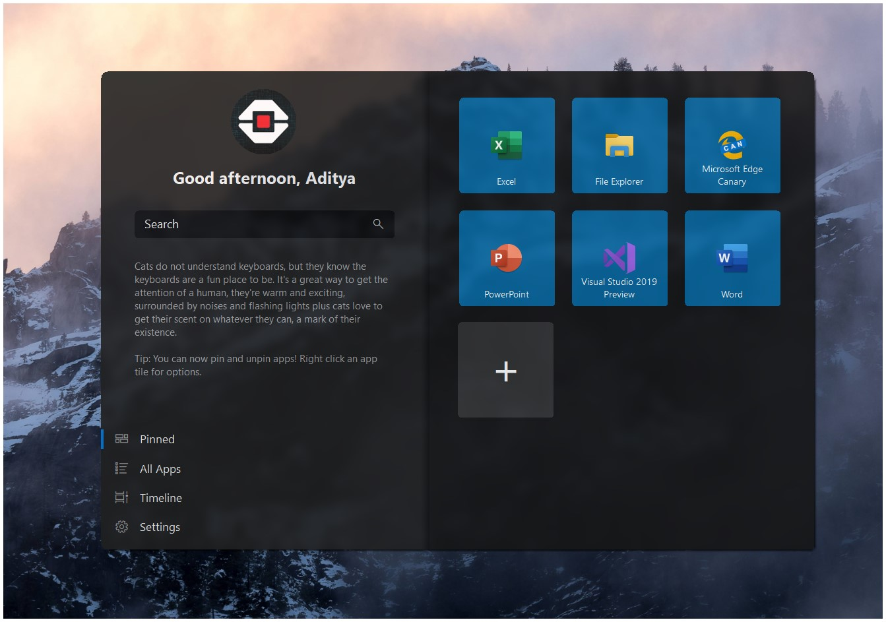
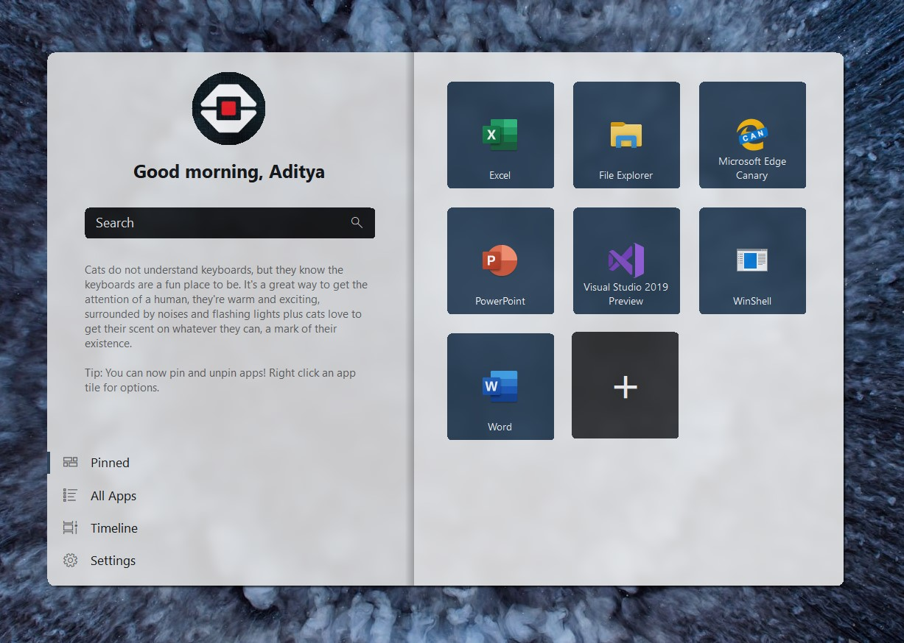

# Winshell

  

My attempt at a shell/ux replacement for windows... IN VB!!
May provide a windows 10-esqe ux to older windows versions.

#### Note: At this point, it is basically just a working start menu, nothing too much other than that

## What's New:

###  - The app now follows the System Accent Color.
###  - Fluent-like blurring behind the app.
###  - Can now pin and unpin tiles.
###  - Minor UI Tweaks
###  - Added a Light theme, now follows system theme automatically

  

 - Now shows proper start menu behaviour - like closing when deactivated.

 - Bugfixes, 
Some experimental Fatures added. to enable them, you need to change the flags accordingly in WinShell.exe.config
