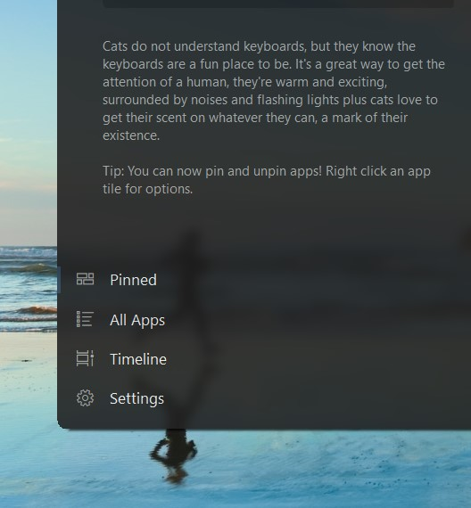
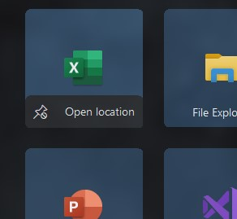
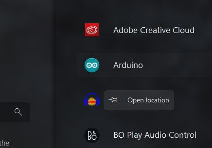

# Winshell

  

My attempt at a shell/ux replacement for windows... IN VB!!
May provide a windows 10-esqe ux to older windows versions.

#### Note: At this point, it is basically just a working start menu, nothing too much other than that

## What's New:

###  - The app now follows the System Accent Color.
###  - Fluent-like blurring behind the app.  

  

###  - Can now pin and unpin tiles.

   &nbsp;&nbsp;&nbsp; 

###  - Added a Light theme, now follows system theme automatically (Incomplete)

  

###  - Minor UI Tweaks
 - Now shows proper start menu behaviour - like closing when deactivated.

 - Bugfixes, 
Some experimental Fatures added. to enable them, you need to change the flags accordingly in WinShell.exe.config

### Bugs
  - It may take around 15 seconds to load all apps if there are too many apps.
  - Tiles may jitter when right clicked
  - Light theme is incomplete
  - Search may work slower than expected when searching in a large number of apps

### Acknowlwdgements
   The design of the start menu is based on a design by Michael West on twitter. Since it was UWP based, i decided to make a working    win32 version.
